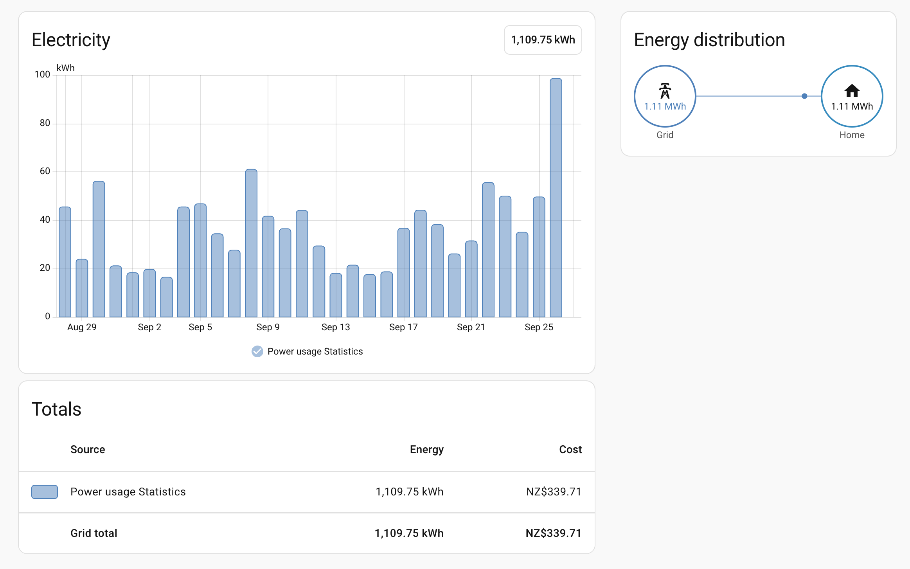
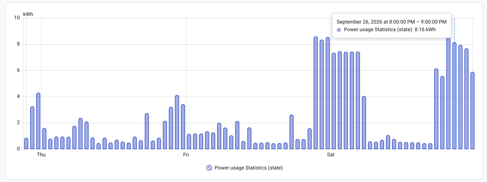
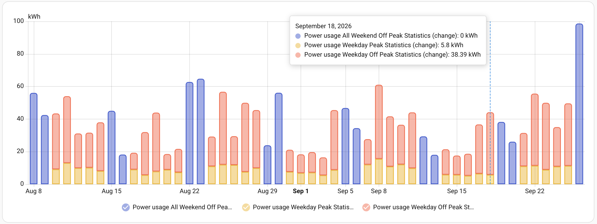
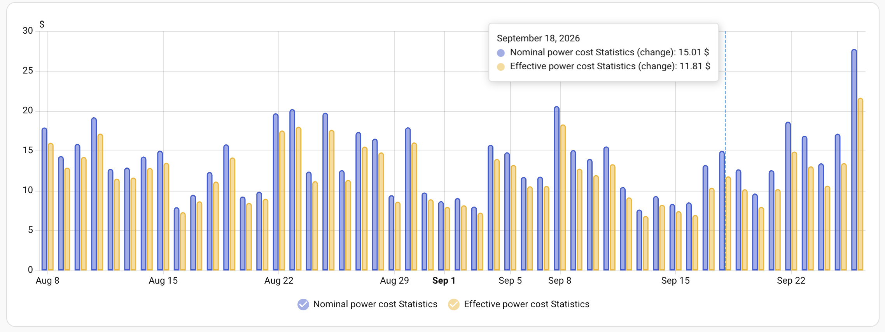
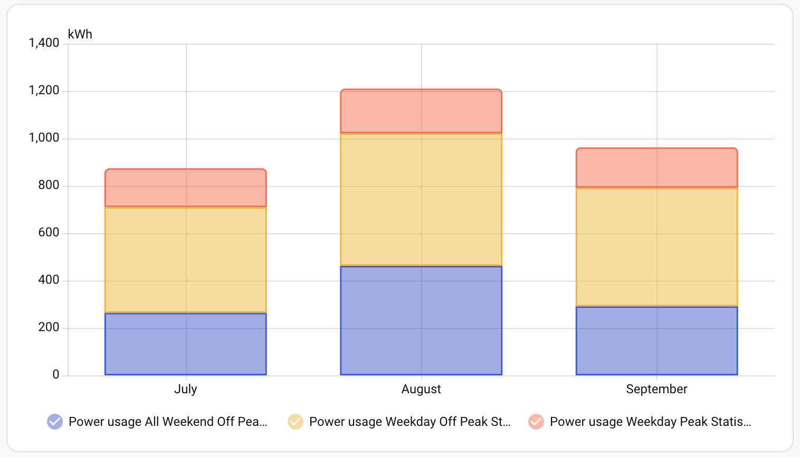
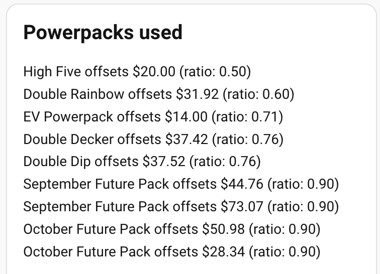

# Powershop NZ — Home Assistant Integration

A Home Assistant custom integration that pulls data from your Powershop New Zealand account. 

##  Disclaimer

This is not an official integration provided by Powershop NZ. It simmply uses their API to extract the data. 

## Features

### Current price sensors

A sensor that reports the current price of a kWh. In addition to the nominal price there's also an effective price sensor that takes into consideration all the purchased (and available) powerpacks. These sensors can be used to provide price information to the Dynamic Energy Cost integration.

### Current rate type sensor

A sensor that reports the current rate type  (peak, off-peak, or any other returned by the Powershop API). This sensor can be used to trigger automations during lower-cost periods. Its worth noting that there might be multiple rates to cover the same type of tariff. For example, my own home connection has two rates: All Weekend Off Peak and Weekday Off Peak that are priced the same. This integration doesn't combine them, so if you need a simple peak/off-peak switch - use a template sensor that checks the current value of this sensor and report accordingly. 

### Side-loading of historical information

Past power usage and costs are available to Home Assistant as statistics. That means that the historical information can be used to populate the fantastic Energy Dashboard. 

### Highly customisable

Sensors can be disabled vie the options menu.

## Sensors

The integration provides the following regular sensors. All entities are in the `sensor.` domain.

| Name | Entity | Description | Unit | Update freqency|
|------|--------|-------------|------|-------------|
| Billing period cost: Effective Total |  `powershopnz_billing_period_`<br>`cost_total_effective` | The cost of electricity in current billing period including powerpacks discounts | NZD | 10 mins | 
| Billing period cost: Nominal Total | `powershopnz_billing_period_`<br>`cost_total_nominal` | The cost of electricity in current billing period using nominal pricing | NZD | 10 mins | 
| Billing period days so far | `powershopnz_billing_period_`<br>`usage_daily_charge` | Number of days in the billing period with usage data so far | days | 10 mins | 
| Billing period usage: Total | `powershopnz_billing_period_`<br>`usage_total` | Total power usage in the current billing period | kWh | 10 mins | 
| Billing period usage: Rate name | `powershopnz_billing_period_`<br>`usage_[*rate_name*]` | Total power usage in the current  billing period during given rate period | kWh | 10 mins | 
| Current billing period start date | `powershopnz_current_billing_period_`<br>`start_date` | The first timestamp of the current billing period | date-time | 5 mins | 
| Current billing period end date | `powershopnz_current_billing_period_`<br>`end_date` | The last timestamp of the current biilling period | date-time | 5 mins |
| Next billing date | `powershopnz_current_next_`<br>`billing_date` | The first timestamp of the next billing period | date-time | 5 mins | 
| Current rate type | `powershopnz_unit_rate_type` | Current rate type (peak, off-peak, night, etc) | 30 sec | 
| Daily charge | `powershopnz_daily_charge` | Daily charge | NZD | 5 mins | 
| Effective cost ratio | `powershopnz_effective_`<br>`cost_ratio` | The proportion of the nominal cost of the units of power including powerpacks discounts | no unit | 10 mins | 
| Effective rate | `powershopnz_effective_`<br>`unit_cost` | The cost of units of power including powerpacks discounts at current time| NZD |  10 mins | 
| Effective rate: Rate name | `powershopnz_effective_`<br>`unit_cost_[*rate_name*]` | The cost of units of power including powerpacks discounts during given rate period | NZD | 10 mins |
| Nominal rate | `powershopnz_nominal_`<br>`unit_cost` | The cost of units of power using nominal pricing at current time| NZD | 5 mins | 
| Nominal rate: Rate name | `powershopnz_nominal_`<br>`unit_cost_[*rate_name*]` | The cost of units of power using nominal pricing during given rate period | NZD | 5 mins | 
| Powerpacks: available balance | `powershopnz_powerpacks_`<br>`available_balance` | The sum value of currently available powerpacks | NZD | 5 mins |
| Powerpacks: future balance | `powershopnz_powerpacks_`<br>`future_balance` | The sum value of powerpacks that will be available in future | NZD | 5 mins |
| Previous billing period cost: Effective Total |  `powershopnz_prevoius_billing_period_`<br>`cost_total_effective` | The cost of electricity in previous billing period including powerpacks discounts | NZD | 10 mins | 
| Previous billing period cost: Nominal Total | `powershopnz_previous_billing_period_`<br>`cost_total_nominal` | The cost of electricity in previous billing period using nominal pricing | NZD | 10 mins | 
| Previous billing period usage: Total | `powershopnz_prevoius_billing_period`<br>`_usage_total` | Total power usage in the previous billing period | kWh | 10 mins | 


In addition to the sensors above the following sensors are also created. They are used to store the historical values based on usage pulled using the API. Since the API doesn't return current (or up to date) values these sensors always report their values as `unknown`, but they provide all the statistical values and can be used for graphing (or in the energy dashboard). The resolution of each sensor is 1h. Technically they only exist to provide placeholders for the long-term statistics.

| Name | Entity | Description | Unit |
|------|--------|-------------|------|
| Nominal power cost | `powershopnz_historical_`<br>`nominal_cost_total` | The total cost of energy (using nominal rates) | NZD | 
| Effective power cost | `powershopnz_historical_`<br>`nominal_cost_total` | The total cost of energy (using effective rates) | NZD | 
| Nominal power cost Rate name | `powershopnz_historical_`<br>`nominal_cost_[*rate_name*]` | The  cost of energy used during given rate period (using nominal rates) | NZD |
| Power usage | `powershopnz_historical_`<br>`usage_total` | The total usage of energy | kWh | 
| Power usage Rate name | `powershopnz_historical_`<br>`usage_[*rate_name*]` | The usage of energy  during given rate period | kWh |

### Attributes

The following sensors provide addtional information through attributes:

| Name | Attribute | Description |
|------|-----------|-------------|
| Billing period cost: Effective Total | `powerpacks` | List of powerpacks that will be used to achieve the effective cost |
| Powerpacks: available balance | `powerpacks`| List of available powerpacks |
| Powerpacks: future balance | `powerpacks` | List of powerpacks that will be available in future | 

## Notes

During the first run the integration attempts to download all available usage information. That might take a few minutes to complete. Only once the data has been downloaded the sensor values are be populated. 

The effective rates and costs are recaluated every time a powerpack is purchased or past usage information is made available by Powershop. That means that the rate fluctuates as consumption changes. The daily effective rate (and the historical effective power cost) changes daily and only provides an approximate cost throughout the billing period, becoming most accurate on the last day of the billing period.

The effective cost ratio is calculated only using the costs of units (kWh) of energy. The daily charge always remains unaffected by the ratio, which is the same Powershop presents their "special" rates. It's worth noting that the official "special" rates are indicative only. 

All costs are calculated in the integration, so there might be some small differences when it comes to nominal costs due to rounding. It's done this way because downloading both costs and usage seems to be much slower than downloading the usage alone, also calulcating the costs in the integration make it easier to caluclate the discounted rates. 

The statistics are always with 1h resolution, but due to the way they're loaded (using the historical sensor) they don't behave exactly the same way regular sensors do. Please have a look at the examples. 

The billing period always rolls over into the next one before all data is available (powerpacks are "consumed" on the last day of the billing cycle when there's still no usage information for the last day). The billing period data then become available in the 'Previous billing' sensors. 

The way power prices are structured varies widely across the country. The types of rates as well as meter setups are different between different local lines companies. I live in West Auckalnd on Vector's network and that's what I've been testing with. If you're in a different part of the country and the integration doesn't work for you - please open an issue. 

## Known issues

1. Switching between rates (peak/off-peak) doesn't happen at exact times. The integration updates the sensor with the current rate type every 30 seconds. 
2. Historical data that's loaded into statistics (like past power usage or past cost) can not be updated once stored. Since Powershop doesn't always release past usage information in chronological order newer data always blocks older data from being stored, that leads to gaps in the statistcs. So far I have not found a user-friendly workaround. Deleting the integration does not delete the statistics from Home Assistant either. The only way to delete them right now is to delete them from the database directly. 
3. The accuracy of past information is not great initially. That's because a lot of historical information (like past rates or alrady consumed powerpacks) are not accessible via the API. This integration stores all the information as the time progresses and after two full billing cycles the past usage and pricing will be accurate. 

## Examples 

### Energy dashboard

This integration can be used to feed data into the Energy dashboard. In order to get it going configure the "Grid connection":

Energy imported from grid: `Power usage Statistics`  sensor.

Cost tracking: 
- Use entity tracking the total costs
- Select either `Nominal power cost Statistics` (for the "standard" rates)
- or `Effective power cost Statistics` (for the approximate effective rates)



### Hourly power usage statistics

The hourly consumption can be graphed using the standard "Statistics graph card" using the following `yaml` definition:
```
type: statistics-graph
grid_options:
  columns: full
entities:
  - entity: sensor:powershopnz_historical_usage_total
days_to_show: 4
period: hour
chart_type: bar
stat_types:
  - state
```



### Daily usage by rate type

The split in usage by rate type can be graphed using the "Statistics graph card" using the following `yaml` defintion:
```
type: statistics-graph
grid_options:
  columns: full
entities:
  - sensor:powershopnz_historical_usage_all_weekend_off_peak
  - sensor:powershopnz_historical_usage_weekday_peak
  - sensor:powershopnz_historical_usage_weekday_off_peak
days_to_show: 50
period: day
chart_type: bar-stack
stat_types:
  - change
```



### Comparing effective and nominal daily costs

The nominal and effective dialy costs can be compared on a single graph using the "Statistics graph card" using the following `yaml` definition:
```
type: statistics-graph
grid_options:
  columns: full
entities:
  - sensor:powershopnz_historical_nominal_cost_total
  - sensor:powershopnz_historical_effective_cost_total
days_to_show: 35
period: day
chart_type: bar
stat_types:
  - change
```
What's worth noting is that for this graph to work the `stat_type` must be set to `change` and not `state`.



### Monthly summary by rate type

Monthly summary by rate type can be crated using the "Statistics graph card" and the following `yaml` definition: 

```
type: statistics-graph
grid_options:
  columns: 24
  rows: auto
entities:
  - sensor:powershopnz_historical_usage_all_weekend_off_peak
  - sensor:powershopnz_historical_usage_weekday_off_peak
  - sensor:powershopnz_historical_usage_weekday_peak
days_to_show: 365
period: month
chart_type: bar-stack
stat_types:
  - change
```


The actual names of the sensors are dynamically generated based on what the Powershop API returns for your account, so the names might be different.

### List of powerpacks that were used to achieve the discounted rate

THe list can be extracted using the "Markdown" card and the following `yaml` definition:
```
type: markdown
content: |
  ## Powerpacks used

  {{ state_attr(
       'sensor.powershopnz_billing_period_cost_total_effective',
       'powerpacks'
     ) }}
grid_options:
  columns: 12
  rows: auto
```



## Releases

### v1.0.0 (2026-09-25)
- First release

## Acknowledgements 

This integration uses the [Historical sensor](https://github.com/ldotlopez/ha-historical-sensor) by Luis López. 
##  License

This project is licensed under the GPL License - see the [LICENSE](LICENSE) file for details.

